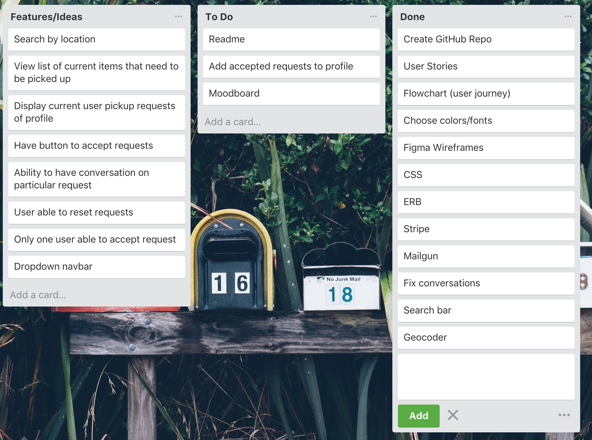
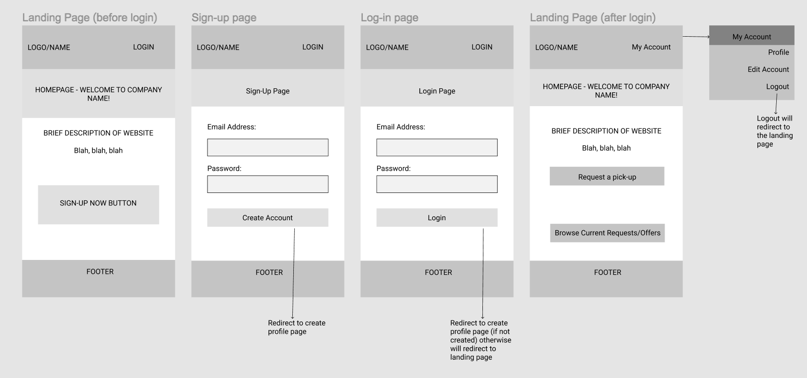

# Rails Project

[Passerby WebApp](https://passerby-app.herokuapp.com/)

[GitHub Repository](https://github.com/jessodri/passerby)

Passerby is a two sided marketplace for people to arrange pick-up and delivery of items they have purchased or for them to pick-up and deliver an item/s for someone else. 

For example, if someone travels between the CBD and Pakenham each day for work they could potentially pick up an item for someone who may live in Pakenham but is unable to travel into the CBD.

## The Problem

People often want to buy items that require travelling/pick-up. This can be difficult if the buyer does not have a car and/or time to go get the item.

## The Solution

This arrangement benefits both parties as the person receiving the item does not have to travel to pick-up or pay expensive postage. The person delivering the item will earn a little extra money but not have to go out of their way.

## Financial Aspect

It will be up to the user to post how much they are willing to pay for the pick-up and delivery of their item as it will vary based on distance and size of the item. I will likely post some recommended guidelines on the site.

I will take a percentage from each transaction that happens on the site.

## Installation
Clone or download the repo

``` git clone git@github.com:jessodri/passerby.git ```

Install gems

```bundle install```

Create ```.env``` file and add environment variables

Create Database

```rails db:create```

Migrate tables

```rails db:migrate```

Start server

```rails server```

Open in your browser and navigate to http://localhost:3000.

## Planning Process

### Name

I chose the name Passerby as it suits the idea of people picking up items as they are 'passing by'. I also wanted a name that was short and uncomplicated.

### Trello Board

[Trello Board](https://trello.com/b/Mac7gHE5)

I user Trello to write my user stories, list possible features and keep track of what I needed to complete as I built my app.





### User Stories

#### Person Requesting Item

* As a user I want to have my item delivered so that I do not have to drive somewhere to get it
* As a user I want to have my item delivered so that I have time for other things
* As a user I want to have items delivered for a low cost so that I can save money
* As a user I want to be able to find someone to pick-up my item quickly and easily so that I don't have to wait a long time
* As a user  I want to have the freedom to buy items in any location so that I have more options available
* As a user I want to be able to pay online so that we are not dealing with cash payments
* As a user I want to be able to view profiles of people who do pick-ups/drop-off in my area so that I can ask them directly to pick something up
* As a user I want to be able to message the pick-up person directly so that we can make arrangements

#### Person Picking Up Item

* As a user I want to be able to see what items need to be picked up along the route I travel so that I can pick jobs close to me
* As a user I want to find jobs so that I can earn extra money
* As a user I want to know the pick-up and drop-off location so that I can plan my journey
* As a user I want to be able to save jobs to a list so that I can keep track of them
* As a user I want to be paid securely and quickly so that I don't have to harass the requester for payment
* As a user I want to be able to list where I tend to travel so that people can find me and request that I pick an item for them
* As a user I want to have a profile page so that people can find out where I do pick-ups

### User Journey

I created a user journey flowchart to help visualize the site layout from the perspective of the user. I helped me to plan an efficient layout for my site.


### ERD

My database had 6 tables in it, which was a managable number. Any more and I think I would have struggled to keep things organized.


## Design

I wanted to keep my design simple and clean. I chose 4 main colors:


I chose two fonts; Crimson Text for headings and Open Sans for paragraphs. I did not spend a lot of time browsing/testing fonts, I picked the first 2 that I liked and went with them!


For my logo I wanted to incorporate the 'P' and 'B' from Passerby and came up with the below logo:


### Figma Wireframes
[Figma Design](https://www.figma.com/file/FvsDpxM6EfvKTNHwqbk1uiAu/Rails-Project?node-id=3%3A0)

I started off with a very basic greyscale design to decide on my layout:




I experimented with a couple of colors but ultimately I stayed with the blue. I was not happy with my first attempts at designing the landing page:


I ended up going with the below design as it seemed much cleaner and user friendly:


My desktop version is very similar to my mobile design and it scales quite well without me having to do too much extra CSS.


## Coding

### Gems Used
I used a number of gems during my project including:

- mailgun-ruby - for sending emails
- stripe - for transactions
- devise - for authentication
- pundit - for authorization
- country_select - provides country codes
- geocoder - provide latitude and longitude for addresses
- aws-sdk-s3 - for AWS S3 storage
- pry-rails - debugging help
- dotenv - environment variables

For shrine (image uploading):
- image_processing - for shrine (image uploading)
- fastimage
- mini_magick
- shrine

### Features


### Future Development

There are so many things that I could do to improve my application that I just did not have time for or do not yet have the skills.

- 
###
